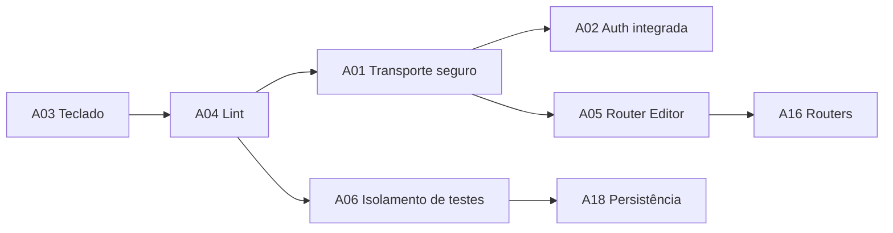

# Forward — Plano de ação Cue Studio (2026-10-04)

Origem: auditoria em [diagnostico.md](../../_reversa_sdd/auditoria-2026-10-04/diagnostico.md) e [plano-de-acao.md](../../_reversa_sdd/auditoria-2026-10-04/plano-de-acao.md) — versão **2.5.2**, commit **27cadae**.

Esta pasta materializa o **primeiro ciclo** do plano em formato executável pelo pipeline Reversa. Cada ação da auditoria virou uma *feature* (arquivo `0X-feature-*.md`) com requirements, plano, contrato, teste de aceitação e critério de pronto.

## Política

- `.reversa/reversa-config.json` está em `allowLegacyEdits: false`, `allowedPaths: []`.
- Esta pasta escreve **apenas** dentro de `_reversa_forward/` (pasta própria do Reversa).
- Qualquer alteração em `app/`, `ui/`, `tests/`, `scripts/` exige que **você** edite `.reversa/reversa-config.json` para liberar paths específicos.
- Nenhum patch aqui é aplicado automaticamente. As specs descrevem a mudança; os protótipos rodam isolados para validar a estratégia antes da execução real.

## Backlog executivo (resumo das 24 ações da auditoria)

| ID | Prioridade | Resumo | Status aqui |
|---|---|---|---|
| A01 | P0 | Transporte HTTP com allowlist em vez de patch global de fetch | spec pronta em [`08-feature-a01-secure-http.md`](08-feature-a01-secure-http.md) |
| A02 | P0 (rede) | Política de autenticação integrada ao servidor geral | spec pronta em [`09-feature-a02-auth.md`](09-feature-a02-auth.md) |
| A03 | P0 | Teclado e foco de diálogos | spec pronta em [`07-feature-a03-keyboard.md`](07-feature-a03-keyboard.md) |
| A04 | P0 | Lint sem erros | spec pronta em [`10-feature-a04-lint.md`](10-feature-a04-lint.md) |
| A05 | P1 | Router Editor montado corretamente | spec pronta em [`11-feature-a05-editor-router.md`](11-feature-a05-editor-router.md) |
| A06 | P1 | Isolamento de testes e suítes explícitas | spec pronta em [`12-feature-a06-test-isolation.md`](12-feature-a06-test-isolation.md) |
| A07 | P1 | Mapa de jornadas e protótipos | pendente (UX) |
| A08 | P1 | Componentes compartilhados (diálogo, campo, erro, status) | pendente |
| A09 | P1 | Navegação com projeto persistente e URL | pendente |
| A10 | P1 | Projetos: criação rápida e setup progressivo | pendente |
| A11 | P1 | Dashboard de trabalho | pendente |
| A12 | P1 | Director: etapa, próxima ação, mobile | pendente |
| A13 | P1 | Studio com resultados acessíveis em mobile | pendente |
| A14 | P1 | Fila: ações coerentes e feedback de duração | pendente |
| A15 | P1 | Error Boundary por seção e erro HTTP padronizado | pendente |
| A16 | P1 | Routers por domínio | pendente (backend) |
| A17 | P1 | Separar contratos, slices, transporte e polling | pendente (frontend) |
| A18 | P1 | Matriz de persistência e migrações | pendente |
| A19 | P1 | Retomada de jobs após reinício | pendente |
| A20 | P2 | Reduzir bundle e requests | pendente |
| A21 | P2 | Densidade confortável/compacta | pendente |
| A22 | P2 | Alvos de toque 44 px | pendente |
| A23 | P2 | Foco visível e ARIA | pendente |
| A24 | P3 | Telemetria de runtime | pendente |

## Sequência recomendada para o ciclo 0

A03 e A04 são pequenas e independentes — podem ir primeiro. A01 destrava A02 (UI autenticada) e A15 (erros estruturados). A05 entra em paralelo porque é a assinatura de uma factory de router. A06 entra cedo para garantir que qualquer teste novo respeite isolamento de singletons.

## Como ler uma feature

Cada arquivo `0X-feature-*.md` segue o template abaixo:

1. **Contexto e referência** — trecho do diagnóstico + caminho do código-fonte previsto.
2. **Requisitos** — comportamento esperado, invariantes e fora de escopo.
3. **Contrato** — assinatura/forma JSON/Rota esperada.
4. **Plano de mudança** — sequência mínima, com reversão.
5. **Testes de aceitação** — comandos ou specs reproduzíveis.
6. **Critérios de pronto** — itens verificáveis pelo usuário.
7. **Riscos e mitigações** — incluindo o que **não** mexer.

## Protótipos e utilitários

- [`prototypes/`](prototypes/) — scripts isolados que demonstram a abordagem esperada sem tocar `app/` ou `ui/`. Servem para validar estratégia e dar confiança antes da implementação real.
- [`checklists/`](checklists/) — listas curtas para verificação manual (teclado, foco, contraste, etc.).

## Handoff

[`HANDOFF.md`](HANDOFF.md) traz o resumo final, dependências e o que **você** precisa fazer para liberar a implementação (paths em `.reversa/reversa-config.json`).