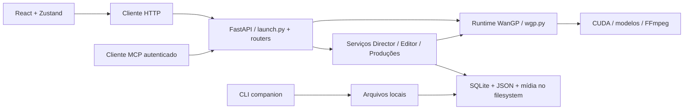

# Diagnóstico do Cue Studio

Data: **04/10/2026**, referência de calendário America/Sao_Paulo. Versão declarada: **2.5.2**. Commit analisado: **27cadae**. Plano correspondente: [plano-de-acao.md](plano-de-acao.md).

O Cue Studio já possui uma base tecnológica atual e recursos expressivos de produção criativa. A melhoria de maior retorno é tornar os fluxos mais previsíveis, corrigir falhas de segurança e qualidade verificadas e reduzir o acoplamento entre interface, API e execução dos modelos. A modernização deve aproveitar React, FastAPI, SQLite, testes e serviços existentes.

## Escopo e confiança

- 🟢 **CONFIRMADO**: observação direta no código, comandos executados ou inspeção no navegador.
- 🟡 **INFERIDO**: interpretação de risco, impacto ou proposta; depende de medição/validação.
- 🔴 **LACUNA**: assunto não validado nesta auditoria.

Foram examinados a estrutura, manifests, CI, launcher, API, persistência, serviços de execução, stores e telas principais. O inventário do Scout de 02/10 foi usado como ponto de partida; as conclusões abaixo foram conferidas no checkout atual. Esta auditoria atende ao pedido de diagnóstico e planejamento; não declara concluída a extração SDD nem altera o estado do pipeline Reversa.

A inspeção visual usou Chromium, React em modo de desenvolvimento e APIs interceptadas com fixtures em memória, em **1440×960** e **390×844**. Foram examinadas oito seções e o diálogo de criação de projeto. As capturas representam telas sem mídias e produções reais. Não houve geração com GPU, download de modelos ou teste de exportação real. A inspeção por fixtures não equivale a um teste ponta a ponta do backend.

## Base atual e pontos a preservar

| Área | Evidência atual | Avaliação |
|---|---|---|
| Frontend | React 19.2, TypeScript com `strict`, Vite 7, Tailwind 4 e Zustand 5 em `ui/package.json` | 🟢 Stack atual; a troca de framework teria baixo retorno demonstrado |
| API | FastAPI, routers extraídos e serviços de domínio | 🟢 Estrutura parcialmente modularizada; ainda depende muito de `launch.py` |
| Geração | Modelos, offload, perfis, preflight, estimativas, downloads e recuperação de OOM | 🟢 Valor central do produto; preservar compatibilidade por família de modelo |
| Produção | Director, revisão por cena, fila, produções, retomada e integração com Editor | 🟢 Funcionalidades já existentes; melhorar integração e verificabilidade |
| UI | Temas claros/escuros, tokens CSS, componentes compartilhados e controle Básico/Expert | 🟢 Um sistema de design parcial já existe |
| Performance UI | Lazy loading, paginação de outputs e cache de thumbnails | 🟢 Melhorias anteriores devem ser aproveitadas |
| Persistência | JSON legado e SQLite com WAL em serviços de estado e produções | 🟢 Migração parcial; avaliar responsabilidades de cada armazenamento |
| Qualidade | 62 arquivos Python de testes; contratos de controles/stores; CI com build e lint | 🟢 Há uma base de proteção relevante, com lacunas de integração |
| Distribuição | Launcher local, venvs por runtime e CLI companion | 🟢 Adequado ao uso local; reproduzir a instalação continua importante |

## Arquitetura observada

O diagrama resume responsabilidades; não afirma que todas as rotas compartilhem o mesmo controle de acesso. O MCP tem autenticação própria. A API geral precisa de verificação separada.

Os seguintes tamanhos foram contados diretamente. Contagem de linhas é um sinal de concentração, não uma medida isolada de complexidade ou desempenho.

| Arquivo | Linhas | Responsabilidade concentrada |
|---|---:|---|
| `app/launch.py` | 29.897 | Inicialização, endpoints, configurações, storage, geração e exportação |
| `app/wgp.py` | 15.327 | Runtime e integração com o legado de geração |
| `app/services/director/planners/short_film.py` | 11.052 | Planejamento de filmes |
| `app/services/director_pipeline.py` | 8.151 | Coordenação de produção |
| `app/services/llm_service.py` | 7.481 | Ciclo de vida e chamadas de LLM |
| `ui/src/stores/useStore.ts` | 12.847 | Estado, navegação, persistência, polling e ações assíncronas |
| `ui/src/components/Sidebar/DirectorChat.tsx` | 3.406 | Fluxo criativo, formulários e opções de geração |
| `ui/src/api/client.ts` | 3.215 | Tipos, endpoints e transporte HTTP |

🟡 O custo provável é maior dificuldade de revisão e regressões entre domínios. Não foi medido o tempo de manutenção nem o perfil de CPU/GPU desses arquivos.

## Achados prioritários

### D01 — Navegação por teclado bloqueada

🟢 `ui/src/main.tsx` intercepta Tab em captura no `window` e chama `preventDefault()` globalmente. A inspeção confirmou que o foco permaneceu no botão “New project” após Tab. Isso também prejudica a navegação entre campos de modais, mesmo quando o componente tenta limitar o foco ao diálogo.

**Ação:** restaurar Tab/Shift+Tab convencionais; oferecer indentação com atalho específico ou opção explícita do campo; validar Escape, foco inicial e devolução de foco em todos os diálogos. A [orientação do W3C sobre operação por teclado](https://www.w3.org/WAI/WCAG22/Understanding/keyboard.html) fundamenta essa prioridade.

### D02 — Token aplicado a destinos externos pelo cliente HTTP

🟢 `ui/src/api/client.ts` substitui `window.fetch` e adiciona Bearer sem verificar a origem ou o caminho de destino. Uma chamada para `https://audit.example.invalid/probe`, integralmente interceptada pelo navegador, recebeu **`Bearer audit-dummy-token`**. Foi usado apenas um token fictício; nenhum segredo real ou pedido externo foi enviado.

**Ação:** criar transporte explícito para a API do aplicativo, com verificação de origem/path. Preservar cabeçalhos e opções de objetos `Request`; não alterar chamadas de terceiros. Acrescentar teste de regressão com destino externo interceptado.

### D03 — Autenticação geral não conectada ao servidor

🟢 `app/services/security.py` implementa autenticação opcional, mas a busca nas fontes não encontrou chamada de configuração/verificação conectada ao servidor geral em `launch.py`. O launcher oferece `--share`, que escuta em `0.0.0.0`. O MCP tem controle de acesso próprio em `mcp_access.py`/`routers/mcp.py`; isso não protege automaticamente os outros endpoints.

🟡 Há risco concreto quando o aplicativo é compartilhado na rede. A política deve distinguir uso local e acesso remoto, e garantir proteção uniforme nas rotas de geração, arquivos e configurações.

**Ação:** integrar a política na criação da aplicação e testar acesso remoto sem token, com token inválido e com token válido. A restrição de CORS atual é um controle diferente de autenticação.

🔴 Não foi executado um servidor real para tentar acesso remoto. O achado é de integração no código, não um teste de invasão ou demonstração de exploração externa.

### D04 — Gate de lint está quebrado

🟢 `npm run lint` terminou com **12 erros e 6 avisos**. Os erros abrangem `set-state-in-effect`, variáveis não utilizadas, exports incompatíveis com Fast Refresh, escape desnecessário e `any` em lazy loading. Arquivos afetados incluem `MediaGallery.tsx`, `DirectorChat.tsx`, `DirectorPanel.tsx`, `DirectorReferencePanels.tsx`, `DirectorStatusPanel.tsx`, `Skeleton.tsx` e `lazyComponents.ts`.

**Ação:** corrigir causas sem desabilitar regras globalmente. `.github/workflows/ci.yml` executa lint: o checkout atual falha nessa etapa quando ela é executada com as dependências locais examinadas.

### D05 — Router do Editor não pode ser montado como está chamado

🟢 `app/routers/video_editor.py:48` define `build_video_editor_router(get_editor)`. `app/launch.py:10917` chama `build_video_editor_router()` sem o argumento. A checagem da assinatura confirmou `TypeError: missing a required argument: 'get_editor'`. O bloco captura a exceção e apenas registra a indisponibilidade.

Há endpoints do Editor definidos mais adiante em `launch.py`, portanto isso **não demonstra que o Editor inteiro esteja quebrado**. Demonstra que esse router extraído não é montado. Ele também declara alguns dos mesmos caminhos/métodos dos endpoints inline.

**Ação:** definir o contrato canônico do Editor, resolver a injeção do serviço e remover/compatibilizar as duplicações antes de ativar o router. Acrescentar teste da aplicação composta, da lista de rotas e do contrato consumido pela UI. Testes isolados de router não cobrem essa ligação.

### D06 — Estado global concentra muitas responsabilidades

🟢 Já existem slices e selectors; o store central ainda tem 12.847 linhas, múltiplos timers e chamadas de API. `ui/vite.config.ts` documenta que tentativas de divisão em chunks encontraram problema de inicialização entre módulos.

**Ação:** extrair tipos para contratos neutros; separar domínio, transporte e estado efêmero de UI; continuar a extração de slices usando os contratos existentes como proteção. Verificar grafo real de imports antes de alterar chunks. Imports apenas de tipos não devem ser tratados automaticamente como ciclos de runtime.

### D07 — Inicialização e recuperação de erro precisam de fronteiras claras

🟢 `App.tsx` carrega diversos recursos no mount e mantém polling global de status LLM. `Suspense` existe nas telas; o Error Boundary encontrado cobre especificamente o Dashboard. Não foi encontrado boundary equivalente no shell geral.

🟢 O handler global de exceções em `launch.py` retorna HTML também para falhas da API e informa que a equipe foi notificada; o corpo desse handler não contém envio de notificação nem registro explícito da exceção. A resposta precisa preservar um contrato de erro utilizável pelo cliente e uma mensagem correspondente ao comportamento real.

**Ação:** isolar falhas por seção, mostrar recuperação e disponibilidade do backend, carregar dados segundo a tela e projeto, consolidar polling e descartar respostas obsoletas. Alguns guards de troca de projeto/modelo já existem e precisam ser preservados. A [documentação do React sobre Error Boundaries](https://react.dev/reference/react/Component#catching-rendering-errors-with-an-error-boundary) explica a proteção proposta.

### D08 — Persistência distribuída e retomada de jobs exigem auditoria de contrato

🟢 Há `AppStateDB`, `ProductionStore`, JSON de configurações/projetos e jobs em memória em `launch.py`. A busca não encontrou o uso do singleton de `AppStateDB` pelos demais serviços examinados; `ProductionStore` administra seu próprio acesso ao mesmo caminho padrão do banco.

🟡 A convivência exige uma matriz explícita de fontes de verdade e de migrações. Não há evidência suficiente nesta inspeção para afirmar corrupção ou perda de produções.

**Ação:** mapear cada entidade e seu armazenamento efetivo; testar reinício, migração parcial e restauração em cópias isoladas; consolidar migrações e persistir os jobs que realmente precisem sobreviver ao processo. Retomada de produções já existe: ampliar suas garantias, não recriá-la.

### D09 — Bundle inicial ainda carrega superfície expressiva

🟢 Build medido: entrada JS **879,22 kB / 243,25 kB gzip**; CSS **150,75 kB / 23,23 kB gzip**. Vite avisou que `useEditorStore.ts` é importado de forma estática e dinâmica e não será movido para outro chunk por esse import dinâmico.

**Ação:** medir dependências da entrada, especialmente overlays e `EditorRoundTripBanner`; extrair notificações e contratos leves; estabelecer orçamento por chunk depois de corrigir o grafo. O tamanho atual é uma referência, não prova de uma latência específica.

### D10 — Parte dos testes frontend está fora do fluxo principal

🟢 `directorQueueSlice.test.ts` importa Vitest, mas Vitest não consta em `ui/package.json` e o arquivo é excluído do typecheck. Há scripts adicionais `test-director-queue-slice.mjs` e `test-llm-slice.mjs`; a CI executa apenas os scripts nomeados `test:control` e `test:store`, cujos fontes não referenciam esses scripts adicionais.

**Ação:** tornar a lista de testes executados explícita, integrar os testes relevantes e acrescentar jornadas de navegador à CI. Escolher runner pelo que será usado; os contratos existentes têm valor e podem permanecer.

## Diagnóstico de UI/UX

| Área | Observação e confiança | Melhoria recomendada |
|---|---|---|
| Navegação global | 🟢 Oito seções; contexto do projeto não aparece de modo persistente no header | Mostrar projeto ativo, navegação previsível e ação principal por contexto |
| Dashboard | 🟢 A tela atual é principalmente consulta de pipelines; estado vazio não oferece CTA de criação | Visão de produção com continuar projeto, fila, últimas saídas e primeiro passo explícito |
| Projetos | 🟢 Cards e busca existem; novo projeto já solicita destino, skill, formato e workflow | Oferecer criação rápida com preset recomendado e edição progressiva das opções |
| Director | 🟢 Desktop usa três colunas iguais; há Básico/Expert e breakpoints | Preservar esse arranjo no desktop; explicitar etapa e próxima ação; em mobile usar Briefing/Cenas/Opções sem exigir navegar painéis longos |
| Studio | 🟢 Área `MainContent` fica `hidden` abaixo de `md` em `StudioPage.tsx` | Dar acesso explícito a Controles/Resultados em mobile; manter preview e parâmetros associados |
| Mídias | 🟢 Filtros e inspector existem; mensagem vazia ainda orienta “Director → Studio” embora Studio tenha aba própria | Corrigir instruções; reforçar ações reutilizar, editar, comparar e enviar ao projeto |
| Fila | 🟢 Tem tela própria e estados específicos; inspeção visual usou fila vazia | Validar jobs reais/fixtures ricas; indicar etapa, progresso, motivo de espera e ações válidas por estado |
| Editor | 🟢 UI de timeline, inspector, exportação e retorno à IA existe | Destacar salvamento e estado de exportação; testar ida/volta por mídia e persistência da timeline |
| Configurações | 🟢 Temas e painéis especializados já existem | Mostrar diagnóstico de runtime e configurações por tarefa; manter hardware avançado progressivo |
| Tipografia | 🟢 Tokens base de 13 px, small 12 px e extra small 11 px; diversos controles inspecionados usam 10–12 px | Definir densidade confortável e compacta; aumentar texto de tarefa e instruções sem expandir indiscriminadamente a timeline |
| Alvos de interação | 🟢 Há controles com uma dimensão menor que 24 px nas telas examinadas | Avaliar área clicável e espaçamento; adotar alvos confortáveis, principalmente em toque |
| Modais | 🟢 Projeto possui role e `aria-modal`; WelcomeModal não usa essa estrutura nem gerenciamento explícito de foco | Compartilhar componente de diálogo com foco, Escape, restauração e política de fechamento |
| Responsividade | 🟢 Telas inspecionadas tiveram `scrollWidth` igual ao viewport | Tratar tarefas e conteúdo útil no mobile; ausência de overflow global não comprova usabilidade |
| Consistência | 🟢 README/HANDOFF e walkthroughs descrevem estruturas anteriores; `HardwareStatusBar` está definido sem uso encontrado | Atualizar navegação, terminologia e documentação; decidir onde exibir contexto e telemetria sem sobrecarregar a criação |

Os controles abaixo de 24 px são **candidatos a revisão**, não um veredito automático de desconformidade: o [W3C permite condições de espaçamento e exceções](https://www.w3.org/WAI/WCAG22/Understanding/target-size-minimum.html). Contraste, zoom 200%, leitor de tela e todas as jornadas ainda precisam de verificação específica.

🟡 A proposta visual é conservar a identidade cinematográfica e os temas existentes, com maior legibilidade, espaço funcional, estados claros e ações contextualizadas. Acrescentar cores ou animações sem resolver as tarefas teria retorno limitado.

## Verificações executadas

| Verificação | Resultado | Limite |
|---|---|---|
| TypeScript app e configuração Vite, `--noEmit --incremental false` | 🟢 Passou | Testes `.test.ts` excluídos pela configuração existente |
| Vite build com saída nesta pasta Reversa | 🟢 Passou | Aviso de import estático/dinâmico do editor; não executa lint |
| `npm run lint` | 🟢 Falha reproduzida: 12 erros, 6 avisos | Falha de qualidade verificada, não falha de compilação |
| `npm run test:control` | 🟢 Passou | Contratos de controles e planejamento, sem GPU |
| `npm run test:store` | 🟢 Passou | Fixtures; logs esperados de erro/cancelamento foram emitidos |
| Segurança/path safety via unittest | 🟢 8 testes passaram | Não comprova autenticação integrada no servidor |
| Estado SQLite via unittest | 🟢 11 testes passaram | Inclui singleton padrão; ver registro operacional abaixo |
| Ciclo de jobs via unittest | 🟢 4 testes passaram | Transições e concorrência em processo |
| Inspeção Chromium | 🟢 Oito seções em duas larguras, captura do diálogo, teste de Tab e token fictício | Fixtures sem geração real |
| Assinatura de router do Editor | 🟢 Incompatibilidade da chamada confirmada | O servidor completo não foi iniciado |
| Suíte completa pytest e smoke imports | 🔴 Não executada | `pytest` ausente nos intérpretes examinados |
| Modelos/GPU, duração real, export e retomada após crash | 🔴 Não executados | Precisam de fixture persistida isolada e runtime operacional |
| Auditoria de vulnerabilidades de dependências | 🔴 Não realizada | Não se afirma ausência ou presença de CVEs |

O build foi executado com o config loader `runner` e saída em `build/` desta auditoria para preservar `ui/dist`. O preview usou cache Vite nesta pasta. O fonte Python foi executado com `PYTHONDONTWRITEBYTECODE=1`.

O preview foi encerrado ao concluir. Build/cache temporários foram removidos; [verificacoes.json](verificacoes.json) preserva comandos, resultados e tamanhos medidos, e as capturas e o script de inspeção foram mantidos.

**Registro operacional:** o teste `AppStateDBSingletonTests.test_singleton_returns_same_instance` inicializou a conexão padrão e tocou o arquivo preexistente `app/.cache/app_state.sqlite3`. Isso contrariou o isolamento de escrita definido para esta análise. Nenhum dado de projeto foi deliberadamente alterado, e não foi feita limpeza/modificação posterior desse banco. A próxima execução deve injetar o caminho temporário também no singleton. O incidente foi informado ao usuário; não se declara que todos os arquivos de runtime permaneceram intocados.

## Evidências e pendências

- [Plano de ação e backlog](plano-de-acao.md).
- [Dados da inspeção UI](ui-evidencias.json) e [script de reprodução com APIs interceptadas](inspecao_ui.py).
- Capturas: [Projetos desktop](ui-projects-1440.png), [Director desktop](ui-director-1440.png), [Studio desktop](ui-studio-1440.png), [Editor desktop](ui-editor-1440.png), [Studio mobile](ui-studio-390.png), [Director mobile](ui-director-390.png), [novo projeto](ui-new-project-1440.png). Demais capturas estão nesta pasta.
- Fontes de arquitetura: [launch.py](../../app/launch.py), [store principal](../../ui/src/stores/useStore.ts), [CI](../../.github/workflows/ci.yml), [estado SQLite](../../app/services/app_state_db.py), [router Editor](../../app/routers/video_editor.py).

🔴 Faltam entrevistas com criadores, benchmark em hardware de referência, validação de modelos por capacidade, teste de rede autenticada e jornadas com produções reais. Essas lacunas orientam os critérios de entrega do plano; não impedem corrigir os achados já confirmados.
