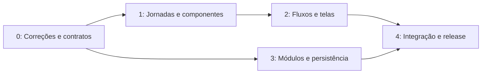

# Plano de ação — melhorias, modernização e UI/UX

Referência: **04/10/2026**, Cue Studio **2.5.2**, commit **27cadae**. Base: [diagnóstico e evidências](diagnostico.md).

**Direção:** tornar o caminho projeto → briefing → geração → revisão → edição → exportação claro e confiável, mantendo a capacidade dos modelos existentes. Primeiro corrigir falhas verificadas; depois simplificar a experiência e reduzir o acoplamento com entregas pequenas e reversíveis.

As tarefas abaixo são propostas para implementação, não alterações já aplicadas. Estimativas são 🟡 **INFERIDAS**, em dias úteis de execução por profissional familiarizado com o projeto. Precisam ser recalibradas após o primeiro ciclo e não incluem downloads, tempos de geração nem espera por avaliação externa.

## Política de execução

🟢 A configuração atual é `allowLegacyEdits: false`, com `allowedPaths: []`. Este plano e suas evidências estão em `_reversa_sdd/`. Implementação futura requer alteração da política **pelo usuário**, conforme `AGENTS.md`; este plano não autoriza editar `.reversa/reversa-config.json`.

Antes de implementar uma tarefa: conferir a política, definir escopo, reutilizar testes/contratos existentes, registrar critérios e preparar reversão. Antes de executar testes: identificar efeitos de escrita e injetar diretórios de dados temporários, inclusive para singletons. Não inicializar caches, bases e presets reais durante os testes de integração.

## Prioridades

- **P0:** falha de segurança, bloqueio de interação essencial ou verificação exigida já falhando.
- **P1:** prejudica fluxo principal, integração ou capacidade de evoluir com segurança.
- **P2:** ganho de produtividade/desempenho e acabamento com dependências anteriores resolvidas.
- **P3:** expansão cuja necessidade ainda deve ser demonstrada.

A prioridade combina gravidade, frequência provável e confiança da evidência. Não é um ranking de arquivos pelo número de linhas.

## Sequência de entrega

| Ciclo | Foco | Entregáveis e saída | Estimativa |
|---|---|---|---|
| 0 | Correções verificadas e baseline | Token limitado à API, política de acesso integrada, teclado restaurado, lint verde, teste de montagem/contrato do Editor | 8–12 dias |
| 1 | Fluxo de produto e fundação UI | Mapa de jornadas, contratos de navegação, tokens de densidade, diálogos acessíveis, protótipo por tarefa | 4–6 dias |
| 2 | Melhorias visíveis da criação | Projetos/Dashboard, fluxo Director, Studio com resultados em mobile, fila e mensagens consistentes | 8–12 dias |
| 3 | Modernização estrutural | Routers por domínio, store/slices e transporte separados, migrações documentadas, recuperação de jobs validada | 12–20 dias |
| 4 | Performance, integração e release | Orçamento de bundle, E2E na CI, teste GPU representativo, exportação, restauração e documentação atualizada | 6–10 dias |

**Ordem de grandeza:** 38–60 dias úteis, aproximadamente **8–12 semanas** com uma pessoa desenvolvedora experiente e apoio parcial de design/QA. Algumas atividades de design podem ocorrer durante o ciclo 0. A execução completa de refatorações profundas dos planners de modelos pode exigir outro ciclo; não está escondida nessa estimativa.

## Backlog executável

Os IDs D01–D10 referem-se aos achados do diagnóstico. Esforço é uma estimativa por item; os ciclos agrupam trabalho e reaproveitamento, portanto as faixas não devem ser somadas mecanicamente.

| ID | Prioridade | Ação e referência | Responsável sugerido | Esforço | Dependência | Critério de aceite |
|---|---|---|---|---|---|---|
| A01 | P0 | Substituir patch global de fetch por transporte da API, D02 | Frontend | 1–2 d | — | Destino externo não recebe token; API recebe quando configurado; `Request`, headers e upload preservados |
| A02 | P0 em rede compartilhada | Conectar política de autenticação ao servidor geral, D03 | Backend | 2–3 d | A01 para UI autenticada | Rotas protegidas rejeitam ausência/token inválido no modo remoto; MCP mantém política própria; modo local documentado |
| A03 | P0 | Restaurar teclado e corrigir foco de diálogos, D01 | Frontend/QA | 1–2 d | — | Criar projeto, mudar seção e fechar diálogo com teclado; Tab/Shift+Tab percorrem foco; atalho de indentação explícito |
| A04 | P0 | Resolver lint atual, D04 | Frontend | 1–2 d | — | Lint sem erros; avisos corrigidos ou justificados pontualmente; build e contratos atuais passam |
| A05 | P1, ciclo 0 | Resolver contrato/montagem do router Editor, D05 | Backend/Frontend | 2–3 d | — | Montagem canônica, sem métodos/paths conflitantes; criar/listar/abrir/apagar aceitam o contrato da UI e o workspace correto |
| A06 | P1 | Padronizar execução e isolamento de testes, D10 | QA/Dev | 1–2 d | — | Nenhum teste usa cache/banco do usuário; lista de suites explícita; testes de fila/LLM relevantes entram no runner/CI |
| A07 | P1 | Mapear jornadas e prototipar tarefas centrais | UX/Produto | 2–3 d | Diagnóstico | Fluxos definidos para Music Video, Short Film, geração manual e exportação; avaliação com 3–5 criadores |
| A08 | P1 | Componentes de diálogo, campo, erro, status e ação | Frontend/UX | 3–4 d | A03, A07 | Componentes compartilhados usados em fluxos centrais; foco, labels, loading e erros consistentes |
| A09 | P1 | Navegação com projeto persistente e URL | Frontend | 2–3 d | A07 | Projeto/seção identificáveis, voltar/avançar funcionam; link permite reabrir contexto sem disparar geração |
| A10 | P1 | Projetos: criação rápida e setup progressivo | Frontend/UX | 2–3 d | A08, A09 | Nome + tipo + preset permitem criar; opções técnicas posteriores; preset e overrides persistem corretamente |
| A11 | P1 | Dashboard de trabalho e primeiro uso | Frontend/UX | 2–3 d | A09 | Sem produção existe CTA útil; com produção existem continuar/revisar e estado de fila, com contexto correto |
| A12 | P1 | Director: etapa, próxima ação e composição responsiva | Frontend/UX | 3–5 d | A07–A10 | Fluxo Music Video/Short Film tem próximo passo visível; três colunas no desktop; painéis acessíveis no mobile sem perda de input |
| A13 | P1 | Studio: resultados acessíveis em qualquer largura | Frontend | 2–3 d | A08, A09 | Em 390 px alternar Controles/Resultados; geração concluída acessível; troca de aba preserva prompt e mídia |
| A14 | P1 | Fila: ações coerentes e feedback de duração | Frontend/Backend | 2–3 d | A08 | Estado mostra ação válida; cancelamento e revisão distinguíveis; estimativa incerta é apresentada como estimativa |
| A15 | P1 | Error Boundary por seção e erro HTTP padronizado, D07 | Full stack | 2–3 d | A01, A08 | Falha de render não remove navegação; API retorna erro estruturado; retomada/repetição explícita sem gerar duplicados |
| A16 | P1 | Extrair API em routers e serviços por domínio, D06 | Backend | 5–8 d | A05, A06 | Primeiro domínio migrado com contratos equivalentes e mesma rota; bootstrap não inclui lógica de negócio desse domínio |
| A17 | P1 | Separar contratos, slices, transporte e polling, D06/D07 | Frontend | 4–7 d | A01, A06 | Um fluxo do Director extraído por vez; timers têm proprietário/cancelamento; respostas tardias não contaminam outro projeto |
| A18 | P1 | Matriz de persistência e migrações, D08 | Backend | 2–4 d | A06 | Fonte de verdade por entidade, schema/migração únicos e backup/restauração testados em cópia |
| A19 | P1 | Job/produção após reinício e cancelamento | Backend/QA | 3–5 d | A18 | Reinício não reexecuta saída concluída; jobs interrompidos sinalizados; retomada mantém snapshot aprovado e destino |
| A20 | P2 | Reduzir bundle e requests por tela, D09 | Frontend | 2–4 d | A17 | Orçamento medido em build; carregamento de editor/overlays segue uso; comparar entry gzip e requests com baseline |
| A21 | P2 | Mídias e Editor: reutilização, comparação e exportação | Frontend/UX | 3–5 d | A05, A08, A09 | Mídia entra na timeline com metadados; retorno IA preserva posição; export exibe progresso e disponibilidade do arquivo |
| A22 | P2 | Instalação reproduzível e pacote CLI | Backend/DevOps | 2–3 d | A06 | CLI funciona em ambiente limpo com dependências declaradas; runtime GPU tem perfil/constraints documentados; UI stale detectável |
| A23 | P1, gate de release | Jornadas reais e simuladas na CI/release | QA/DevOps | 3–5 d | A10–A19 | E2E de projeto, geração simulada, revisão, retorno IA e export; smoke do servidor composto; job GPU representativo antes do release |
| A24 | P2 | Atualizar docs, estados e terminologia | Dev/Produto | 1–2 d | Fluxos finais | README e guias descrevem abas atuais; eliminar instrução obsoleta “Director → Studio”; docs deixam claro o que exige download |

## Direção de UI/UX por tarefa

### Entrada e navegação

O header deve identificar **projeto ativo**, seção e estado de trabalho. Um criador precisa reconhecer onde seu material será salvo antes de gerar. Preservar as seções centrais no primeiro incremento; validar agrupamentos antes de remover abas já conhecidas.

Proposta de rótulos: Dashboard, Projetos, Director, Studio, Editor, Mídias, Fila e Configurações. A tradução completa deve ser uma decisão de produto; uma camada de textos pode começar pelos fluxos centrais e manter inglês como fallback. Não misturar traduções parciais em cada componente.

Preferir uma URL simples para projeto/seção. Rotas por hash podem ser a primeira implementação para evitar exigir fallback SPA no servidor estático atual. Se forem escolhidas rotas de pathname, incluir o comportamento de refresh na entrega backend. Validar IDs de projetos e não executar ações de geração em resposta a uma URL.

### Projetos e Dashboard

Fluxo recomendado: **nome → objetivo (clipe/filme/geração manual) → preset adequado → criar**. O setup detalhado permanece acessível, mas pode ser expandido depois. O usuário deve ver formato e duração estimada/recomendada, sem precisar conhecer imediatamente steps, guidance e LoRAs.

No card do projeto: nome, capa, última atividade, estado da produção e uma ação “Continuar”. Ações como duplicar, fixar, configurar e excluir devem ser acessíveis pelo teclado e por um menu secundário com rótulos. Manter os guardrails existentes que impedem apagar projetos com geração ativa.

No Dashboard: continuar produção, itens em revisão, fila e últimas mídias. O primeiro uso deve explicar o primeiro passo e oferecer criar projeto. A consulta detalhada dos pipelines continua disponível, reutilizando o Dashboard existente como componente quando adequado.

### Director

Tornar visível a sequência **Briefing → Cenas → Revisão → Geração → Resultado**, preservando as etapas técnicas internas e o comportamento já configurado de Auto/Seamless. “Auto” deve explicar que etapas serão puladas, e a preferência do projeto não deve mudar silenciosamente.

No desktop, conservar as três colunas iguais já adotadas. No mobile, oferecer seletor Briefing/Cenas/Opções e manter o CTA relacionado à etapa visível. Alterar largura/disposição não pode resetar formulário, referências ou snapshot de aprovação.

Cada cena deve ter miniatura ou placeholder, tempo/duração, versão/take, status, prompt editável e ação principal. Aproveitar cards e revisão existentes; padronizar a apresentação em vez de construir outro fluxo paralelo.

Antes de executar: resumo de modelo, formato, duração, referências, necessidade de download e possível ajuste de hardware. Mostrar informação de capacidade disponível, sem prometer prazo preciso quando a primeira execução inclui download/compilação.

### Studio, Mídias e Editor

Studio deve apresentar objetivo e inputs antes dos parâmetros avançados. Em mobile, Controles/Resultados garante acesso ao retorno da geração hoje ocultado pela composição da página. Notificar conclusão deve abrir a saída correta no projeto correto.

Mídias deve privilegiar ações concretas: reutilizar parâmetros, comparar takes, favoritar e enviar ao Editor/Director. Preservar paginação e cache; validar listas grandes antes de adicionar uma nova biblioteca de virtualização.

Editor deve mostrar projeto/timeline ativos, status de salvamento e disponibilidade de exportação. A ida e volta de um clipe pela IA deve indicar origem, nova versão e destino sem perder cortes e histórico. Prioridade mobile: monitorar/revisar; edição completa de timeline no toque exige estudo próprio.

### Fila e estados

Unificar a linguagem apresentada ao usuário: aguardando, preparando/download, gerando, aguardando revisão, concluído, falhou e cancelado. Esses rótulos podem mapear os estados internos já distintos; não substituir máquinas de estado existentes sem contrato explícito.

Cada item precisa de projeto, etapa, posição quando aplicável, progresso disponível e ações permitidas. Cancelamento não equivale a falha. Quando houver retomada, mostrar o ponto retomável e o material já produzido.

## Sistema de design e acessibilidade

- Preservar famílias de tema atuais e tokens semânticos; separar cor de marca de sucesso/atenção/erro.
- Densidade **confortável** para formulários e tarefas, **compacta** opcional para timeline e listas técnicas. Referência inicial: texto de tarefa 14–16 px, metadados 12–13 px; validar com criadores, sem tratar esses números como exigência normativa.
- Alvos de toque preferencialmente 44 px; verificar o mínimo e espaçamento conforme [WCAG 2.2 — tamanho de alvos](https://www.w3.org/WAI/WCAG22/Understanding/target-size-minimum.html).
- Foco visível, labels reais, equivalentes de teclado para ações de arrastar, Escape, retorno de foco e anúncios de progresso com `aria-live` moderado.
- Verificar contraste dos temas, zoom 200%, movimento reduzido e leitor de tela. A medição completa ainda é uma lacuna; não declarar conformidade pela existência de atributos ARIA.
- Estados vazio, carregando, indisponível, erro e sucesso devem explicar uma ação seguinte. Evitar prometer “equipe notificada” sem observabilidade que comprove o envio.

## Modernização técnica proposta

### API e runtime

Evoluir para um **monólito modular**: composição da aplicação, routers por domínio, serviços, contratos e adaptadores de runtime. A [documentação FastAPI de aplicações maiores](https://fastapi.tiangolo.com/tutorial/bigger-applications/) oferece o mecanismo de routers; a fronteira de domínio deve vir das responsabilidades existentes.

Primeiros cortes: transporte/configuração de segurança; workspace/storage; contrato Editor; catálogo de modelos; jobs; Director. Os kernels e modelos vendorizados devem permanecer atrás de um adaptador. Extrair funções mantendo assinaturas primeiro; alterar comportamento em uma entrega separada.

Continuar usando o slot/lock de geração e o gerenciador de modelos existentes. Se medições mostrarem que o servidor precisa sobreviver a falhas do runtime, avaliar processo dedicado de geração com fila durável local. Redis/Celery, múltiplos workers GPU e migração para serviços separados entram apenas com necessidade demonstrada e política explícita de memória/concorrência.

### Estado e contratos frontend

Extrair tipos compartilhados para um módulo sem import de UI/store. Dividir o cliente HTTP por domínio atrás de um transporte comum. Separar estado de servidor, preferências e drafts por projeto. Um request deve ter ownership, cancelamento e regra para resposta tardia.

O `queryClient.ts` próprio existe, mas não foi encontrado em uso fora de sua definição. Antes de adotar outra dependência, documentar os requisitos de cache, invalidation, polling e retries. Escolher a solução depois disso; não migrar automaticamente para TanStack Query só para modernizar o nome da biblioteca.

Retries automáticos devem ser limitados a operações seguras. Geração e exportação precisam de chave/id de operação para impedir duplicação. Polling deve parar ou reduzir frequência quando a tela não precisa do dado; feedback de reconexão deve ser explícito.

### Dados, distribuição e observabilidade

Criar matriz **entidade → fonte de verdade → schema → migração → backup → consumidor**. Mídias continuam no filesystem; SQLite pode indexar metadados/estado. Migração de JSON deve ser idempotente, copiável e testada com falha parcial. Não impor conversão de todos os arquivos de modelo/preset.

O pacote CLI importa Click, mas `pyproject.toml` não declara essa dependência runtime. Corrigir a distribuição da CLI em ambiente limpo. Manter runtime de modelos separado, definir dependências leves para testes e documentar perfis CUDA/Python suportados. Upgrade de Torch/Transformers deve incluir smoke por família de modelo; não usar atualização indiscriminada como ação inicial.

Acrescentar eventos/logs estruturados com projeto, job/run e fase; medir inicialização, preparação, download, planejamento, geração e exportação separadamente. Preservar privacidade dos prompts, mídias, caminhos e tokens nos logs. Erros HTTP da API devem ter código, mensagem útil e identificador de operação; detalhes técnicos ficam na inspeção apropriada.

## Métricas e gates de conclusão

| Resultado | Baseline atual | Meta inicial proposta | Como verificar |
|---|---|---|---|
| Qualidade frontend | 12 erros e 6 avisos de lint | Zero erros; avisos resolvidos ou justificados localmente | CI + build + contratos |
| Segurança de token | Fetch externo recebeu token fictício | Zero envio de token para origem não autorizada | Teste de transporte/navegador interceptado |
| Teclado | Tab não move foco no teste | Tarefas centrais operáveis por teclado | Playwright + avaliação manual |
| Bundle entrada | 243,25 kB gzip JS | Redução inicial de 20% se viável após análise do grafo | Build comparável; meta não bloqueia correção funcional |
| Criação de projeto | Formulário técnico inicial; tempo não medido | Reduzir decisões iniciais e tempo em pelo menos 30% | Mesma tarefa e perfis em teste de usabilidade |
| Retomada | Módulos/testes existentes; servidor real não verificado | Zero reexecução silenciosa de saídas concluídas | Reinício controlado com diretório isolado |
| Mobile | Telas cabem; resultados Studio ocultos | Fluxo Controles → Resultado operável em 390 px | Navegador com fixtures e conteúdo longo |
| Feedback de tarefa | ETA/fases existentes; precisão não medida | Toda espera visível tem motivo e ação disponível | Fixtures queued/running/review/error/download |
| Integração | Router Editor chamado com argumento ausente | Aplicação composta monta contrato canônico | Smoke de rotas + jornada UI/API |

Validar em 390, 768, 1280 e 1440 px; temas claro e escuro; teclado; listas com volume; projetos novos e legados; nomes/prompt longos; API indisponível; mudança de projeto durante requests. CI padrão deve usar fixtures determinísticas sem GPU. Testes de runtime/GPU são um gate de release separado e documentado.

## Primeiro ciclo recomendado

1. Fazer A01, A03 e A04: falhas reproduzidas e de pequeno escopo.
2. Fazer A06 antes de ampliar a execução dos testes; todos os dados temporários devem ser isolados.
3. Fazer A02 e A05 com teste da aplicação composta e revisão dos contratos.
4. Medir baseline de duas jornadas: novo projeto até primeiro resultado; produção existente até revisão/exportação.
5. Prototipar A09–A13 usando componentes e temas atuais; validar com criadores antes de mudanças amplas de navegação.

O primeiro incremento demonstrável deve permitir criar um projeto pelo teclado, reconhecer seu contexto, navegar até a geração e consultar o resultado em desktop/mobile, mantendo token restrito à API e os gates de qualidade ativos.
